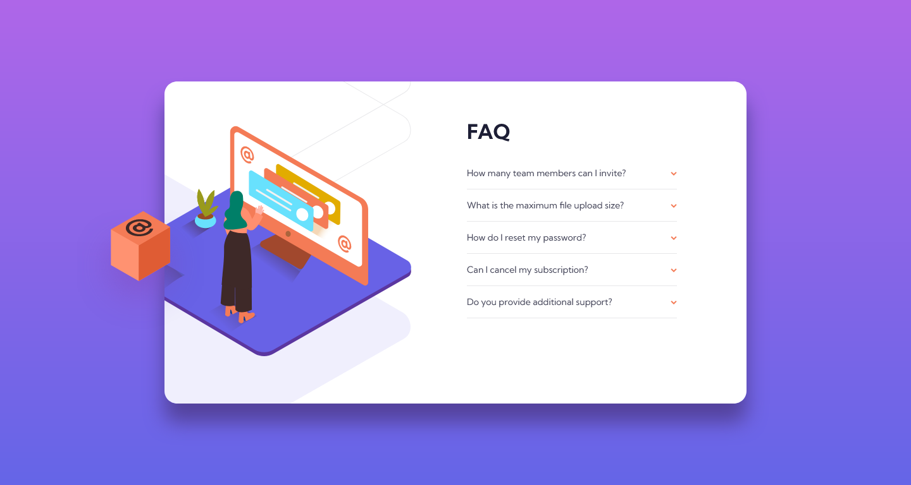
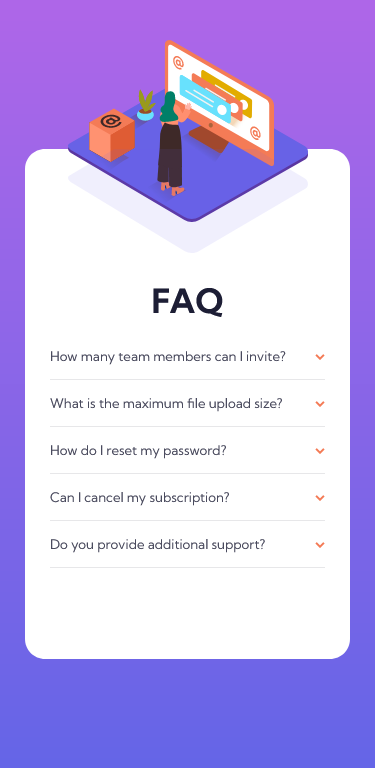

# Frontend Mentor - FAQ accordion card solution

This is a solution to the [FAQ accordion card challenge on Frontend Mentor](https://www.frontendmentor.io/challenges/faq-accordion-card-XlyjD0Oam).

## Table of contents

- [Overview](#overview)
  - [The challenge](#the-challenge)
  - [Screenshot](#screenshot)
  - [Links](#links)
- [My process](#my-process)
  - [Built with](#built-with)
- [Author](#author)

## Overview

### The challenge

Users should be able to:

- View the optimal layout for the component depending on their device's screen size
- See hover states for all interactive elements on the page
- Hide/Show the answer to a question when the question is clicked

### Screenshot

  

### Links

- Solution URL: [code](https://github.com/Aibi-Green/Frontend-Mentor-Projects/tree/main/faq-accordion-card-main)
- Live Site URL: [live site](https://faq-accordion-card-main-ivydev.netlify.app)

## My process

### Built with

- CSS custom properties
- Flexbox
- CSS Grid
- Mobile-first workflow

## Author

- GitHub - [Ivy Lariosa](https://github.com/Aibi-Green)
- Frontend Mentor - [@Aibi-Green](https://www.frontendmentor.io/profile/Aibi-Green)
