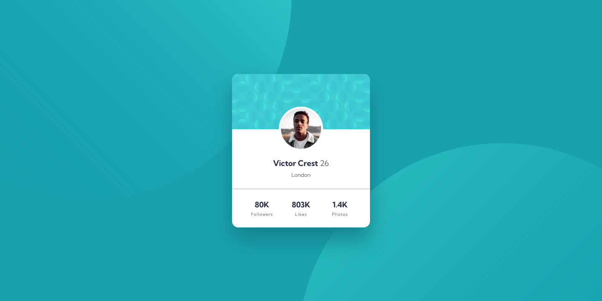
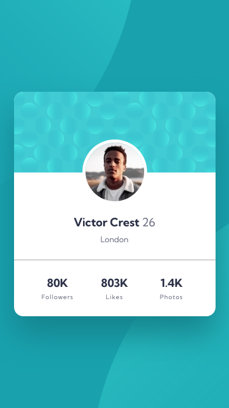

# Frontend Mentor - Profile card component solution

This is a solution to the [Profile card component challenge on Frontend Mentor](https://www.frontendmentor.io/challenges/profile-card-component-cfArpWshJ).

## Table of contents

- [Overview](#overview)
  - [The challenge](#the-challenge)
  - [Screenshot](#screenshot)
  - [Links](#links)
- [My process](#my-process)
  - [Built with](#built-with)
  - [What I learned](#what-i-learned)
- [Author](#author)

## Overview

### The challenge

- Build out the project to the designs provided

### Screenshot

  
  

### Links

- Solution URL: [code](https://github.com/Aibi-Green/Frontend-Mentor-Projects/tree/main/profile-card-component-main)
- Live Site URL: [live site](https://profile-card-component-ivydev.netlify.app/)

## My process

### Built with

- CSS custom properties
- Flexbox
- CSS Grid
- Mobile-first workflow

### What I learned

- use background property to put image in background

## Author

- GitHub - [Ivy Lariosa](https://github.com/Aibi-Green)
- Frontend Mentor - [@Aibi-Green](https://www.frontendmentor.io/profile/Aibi-Green)