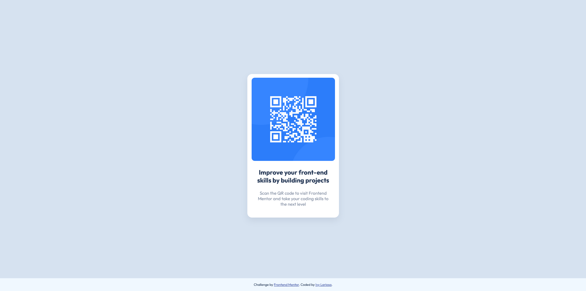

# Frontend Mentor - QR code component solution

This is a solution to the [QR code component challenge on Frontend Mentor](https://www.frontendmentor.io/challenges/qr-code-component-iux_sIO_H).

## Table of contents

- [Overview](#overview)
  - [Screenshot](#screenshot)
  - [Links](#links)
- [My process](#my-process)
  - [Built with](#built-with)
  - [What I learned](#what-i-learned)
  - [Continued development](#continued-development)
  - [Useful resources](#useful-resources)
- [Author](#author)

## Overview

### Screenshot


### Links

- Solution URL: [github folder](https://github.com/Aibi-Green/Frontend-Mentor-Projects/tree/main/qr-code-component-main)
- Live Site URL: [live site](https://your-live-site-url.com)

## My process

### Built with

- HTML 5
- CSS 3

### What I learned

- Vertical align using transform and absolute position
```css
.qr-card {
  position: absolute;
  top: 50%;
  left: 50%;
  transform: translate(-50%, -50%);
}
```

```js
const proudOfThisFunc = () => {
  console.log('🎉')
}
```

### Continued development

- Find a better way to adjust img size according to div width (padding does not reduce an image's size)

### Useful resources

- [HTML Element Alignment](https://blog.hubspot.com/website/center-div-css) - Aligning HTML elements
- [Box-Shadow Property](https://www.w3schools.com/cssref/css3_pr_box-shadow.php) - Box-Shadow Property

## Author

- GitHub - [Ivy Lariosa](https://github.com/Aibi-Green)
- Frontend Mentor - [@Aibi-Green](https://www.frontendmentor.io/profile/Aibi-Green)
