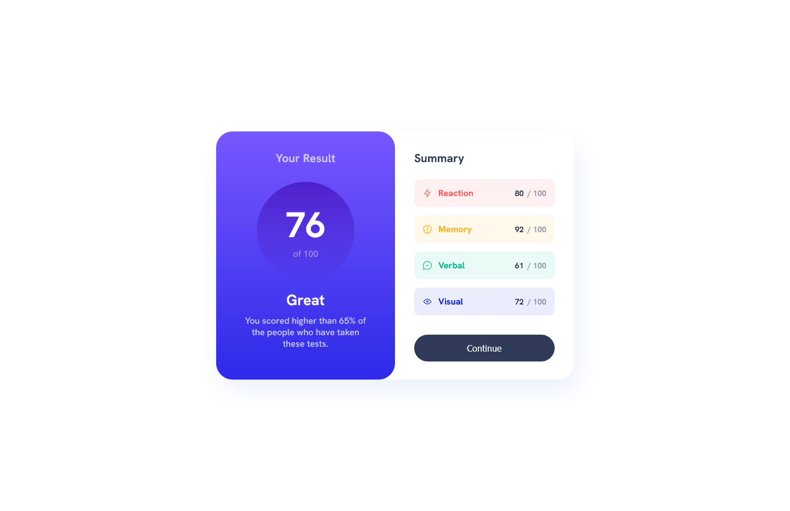
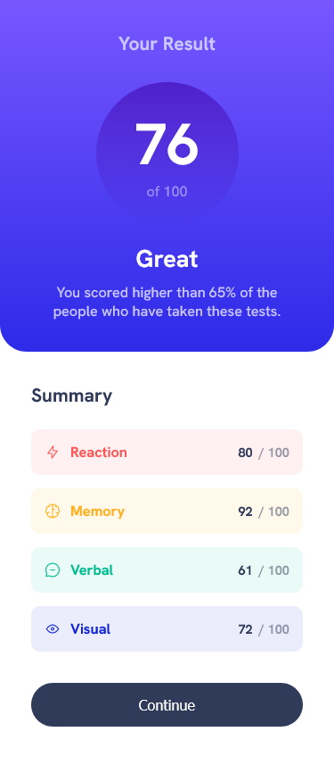

# Results summary component solution

This is a solution to the [Results summary component challenge on Frontend Mentor](https://www.frontendmentor.io/challenges/results-summary-component-CE_K6s0maV).

## Table of contents

- [Overview](#overview)
  - [The challenge](#the-challenge)
  - [Screenshot](#screenshot)
  - [Links](#links)
- [My process](#my-process)
  - [Built with](#built-with)
  - [What I learned](#what-i-learned)
  - [Questions](#questions)
  - [Useful resources](#useful-resources)
- [Author](#author)
- [Acknowledgments](#acknowledgments)

## Overview

### The challenge

Users should be able to:

- View the optimal layout for the interface depending on their device's screen size
- See hover and focus states for all interactive elements on the page

### Screenshot
- Desktop  


- Mobile  


### Links

- Solution URL: [github repository](https://github.com/Aibi-Green/Frontend-Mentor-Projects/tree/main/results-summary-component-main)
- Live Site URL: [live site](https://results-summary-componenet-ivydev.netlify.app/)

## My process

### Built with

- HTML
- CSS

### What I learned

- I learned how to apply display: flex and other flex properties on html elements.
- Always place Media queries at the end
- Always add this code to reset margin, padding, set font size and family, and height of body and main element.
```css
*, *:before, *:after {
    box-sizing: border-box;
    margin: 0;
    padding: 0;
}

body {
    min-height: 100vh;
    /* The font size */
    /* font family */
}

main {
    min-height: inherit;
}
```

### Questions

- Did I use flex properly? I feel like I overused it.
- How do I link json file to js file then to html file?


### Useful resources

- [Frontend Web Development Bootcamp Course (JavaScript, HTML, CSS) by Zach Goller](https://www.youtube.com/watch?v=zJSY8tbf_ys) - Helped me understand the basic css properties along with examples and challenges that made it easy for me to understand style and layout concepts such as flex.

## Author

- GitHub - [Ivy Lariosa](https://github.com/Aibi-Green)
- Frontend Mentor - [@Aibi-Green](https://www.frontendmentor.io/profile/Aibi-Green)
